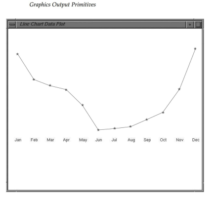
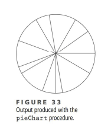

<!--
 * @Author: hiddenSharp429 z404878860@163.com
 * @Date: 2024-11-04 18:35:53
 * @LastEditors: hiddenSharp429 z404878860@163.com
 * @LastEditTime: 2024-11-16 22:14:29
-->
# CG

This is a course assignment repository for the Shantou University computer elective course "Computer Graphics"! Hope it can help you!

这是一个用于存放学校课程《计算机图形学》中课程作业的仓库，仅是个人思路，并且仅供参考，可用于学习交流，请勿用于其他用途。

# Assignments
The following are the task descriptions for each assignment:

以下是各作业的任务说明：
## Assignment 1
- 任务：回答以下问题并且提交相关文件
> 1. What are raster graphics and vector graphics? What features they have, respectively?
> 2. Draw architecture of a simple raster-graphics system and describe how it works.
> 3. As we know, there are many kinds of graphics software in use in practice. Please list at least 
> 4. kinds of graphics software for different application purpose.
- 文件夹：`assignment 1`

## Assignment 3
- 任务： 完成以下目标并且提交相关文件。
> 1. get familar with openGL functions and coding by reading and practice.
> 2. Select two of four example programs (at the end of chapter 4, Graphics Output Primitives.pdf) to run and write down the comments to key codes
Here are the two programs I chose:

- 文件夹：`assignment 3`

## Assignment 4
- 任务：完成以下目标并且提交相关文件。
> 1. Write a program to display a two-dimensional, gray-scale "cloud" scene, where
the cloud shapes are to be described as point patterns on a blue-sky background.
The light and dark regions of the clouds are to be modeled using points of varying
sizes and interpoint spacing. (For example, a very light region can be modeled with
small, widely spaced, light-gray points. Similarly, a dark region can be modeled
with larger, more closely spaced, dark-gray points.)
> 2. Modify the program in the previous exercise to display the clouds in red and yellow
color patterns as they might be seen at sunrise or at sunset. To achieve a realistic
effect, use different shades of red and yellow (and perhaps green) for the points.
- 文件夹：`assignment 4`

## Assignment 5
- 任务：完成以下目标并且提交相关文件。
> (Use only basic OpenGL geometric transformation functions glTranslate* and glRotate* to finish both assignments)
> Functions may used: glutIdleFunc, glutPostRedisplay, Sleep
> 1. Write a program to display an animation of a black square on a white background tracing a circular, clockwise path around the display window with the path’s center at the display window’s center (like the tip of the minute hand on a clock). The orientation of the square should not change. Use only basic OpenGL geometric transformations to do this.
> 2. Modify the program in Exercise 27 to have the square rotate clockwise about its own center as it moves along its path. The square should complete one revolution about its center for each quarter of its path around the window that it completes. Use only basic OpenGL geometric transformations to do this.

- 文件夹：`assignment 5`

## Assignment 6
- 任务：完成以下目标并且提交相关文件。
> 1. Modify the program example on textbook, p273 (Two-Dimensional Viewing.pdf, pp16-17) to achieve zooming effect by successively mapping different size of clipping window (by changing gluOrtho2D parameters) onto a fixed-sized viewport.
> 2. Write a procedure to calculate the elements of matrix 1 for transforming two-dimensionalworld coordinates to viewing coordinates,giventhe viewing coordinate origin P0 and the view upvector V. Test your matrix with p0=(1,2), V=(3,-4) and output your result to screen.
> 3. Write a complete program to implement theCohen-Sutherland line-clipping algorithm.
- 文件夹：`assignment 6`

# Projects
The following are the task descriptions for each project:

以下是各项目的任务说明:
## Project 1
- 任务：完成以下目标并且提交相关文件。
> 1. Design and implement a screensaver with OpenGL functions of output primitives (points, lines and fill areas), attributes and transformations.Example:

