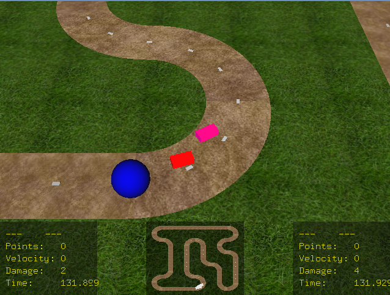

# OpenGLRacing

Simple racing game made with OpenGL.

## IDE & version

vscode 1.90.0

## To compile on Linux:

`$ make`

And then run:

`$ ./test`

## To compile on Windows:

Open **/cglib.vsnet/cglib.sln** with Visual Studio.

And then build and run.

.